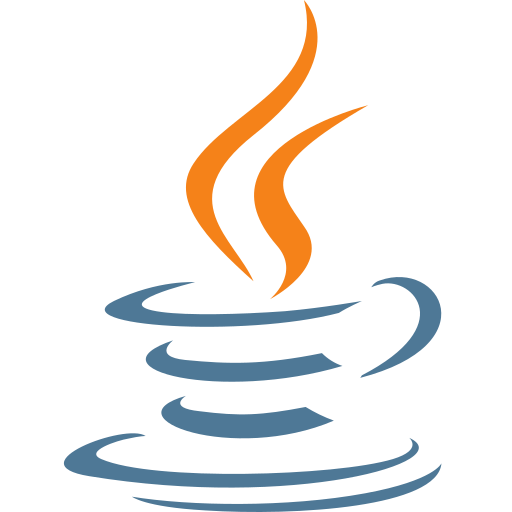

## Salut 👋

- 🐦​ Je m'appelle Bastian KERRIEN, 19 ans et étudiant à l'IUT d'Orléans en 3ème année de BUT Informatique

## 🌱 Mes compétences 

| Langages  | Base de Donnée | Web | Outils |
|:-:|:-:|:-:|:-:|
|||||

## 🔭 Projet
### Réalisation d'une application de gestion des vols

Dans le cadre de mes études, j'ai eu l'occasion de réaliser plusieurs projets comme celui-ci, qui consistait à créer une application de gestion des vols pour un aéroport fictif. Pour ce projet, j'ai :

* Déterminer le modèle de données le plus approprié pour le projet
* Réaliser une SPA, pour visualiser les différentes fonctionnalités de l'application
* Créer une API REST
* Mise en place de plusieurs tests pour la robustesse de l'application

